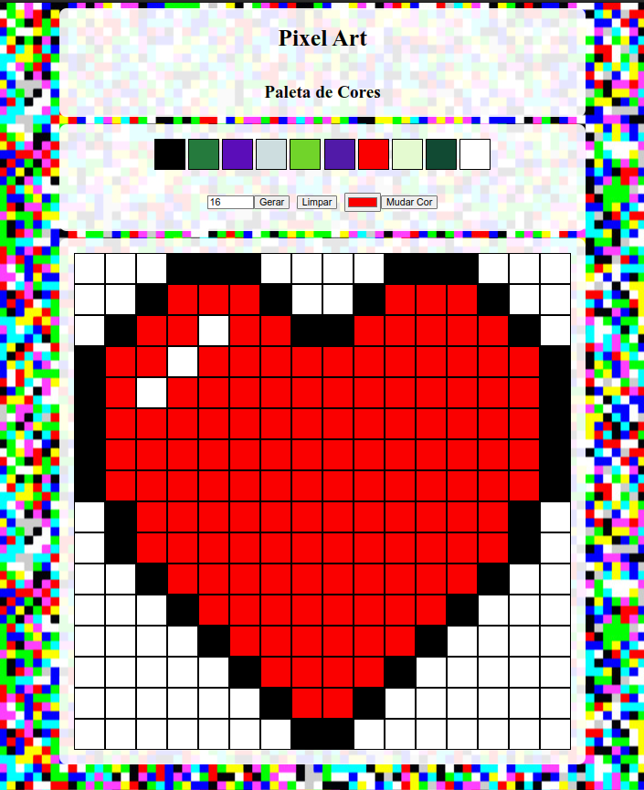

# Trybe-Project-Pixels-Art

Project developed in the web fundamentals module at trybe

## Description

A web page that contains a functional color palette that can be used to create pixel drawings. For `javascript`, `css` and `html` was used.

## Skills developed

- Manipulate the DOM

- Manipulate the JavaScript

## Preview

